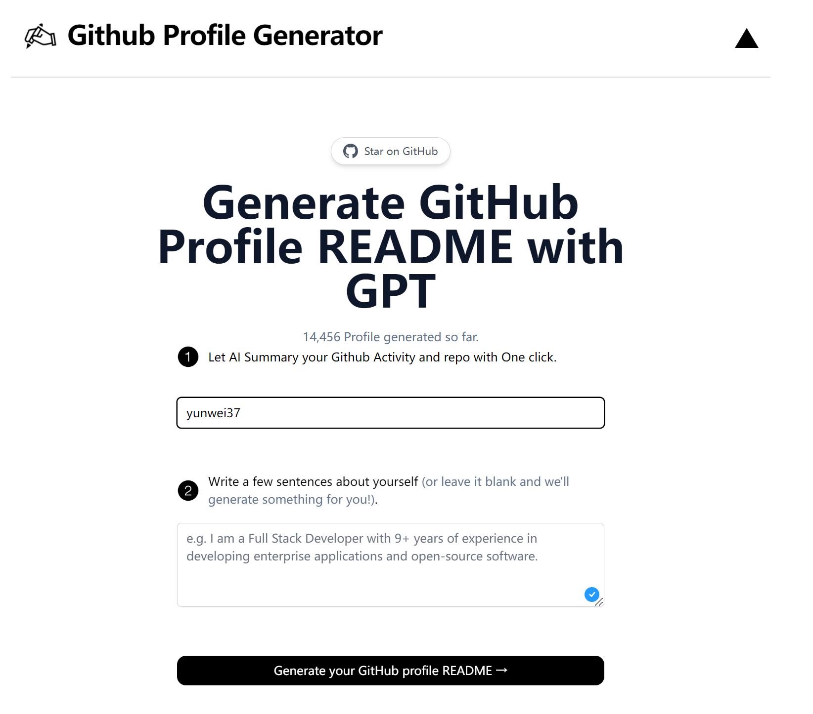

# Github Profile README Generator

Let AI analyze your GitHub and generates beautiful GitHub profile readme files for you with just one click.

[](https://www.readmegenerator.io)

## How it works

This project utilizes AI-powered technology and streamlined processes to generate personalized and attractive GitHub profile readme files. By providing your username and clicking a button, the project will get your repo info and profile info, generates a readme file that showcases your information and projects in an appealing format.

## Running Locally

To run this project locally, follow these steps:

1. Clone the repository.
2. Create an account on [OpenAI](https://beta.openai.com/account/api-keys) and obtain an API key.
3. Create a file named `.env` and add your API key to it.
4. Open a terminal and navigate to the project's directory.
5. Run the following command:

```bash
npm run dev
```

The application will be available at `http://localhost:3000`.

## One-Click Deploy

Deploy your own instance of this project using [Vercel](https://vercel.com?utm_source=github&utm_medium=readme&utm_campaign=vercel-examples):

[](https://vercel.com/new/clone?repository-url=https://github.com/Nutlope/readmegenerator&env=OPENAI_API_KEY&project-name=readme-generator&repo-name=readmegenerator)

Create an amazing GitHub profile readme with ease!
